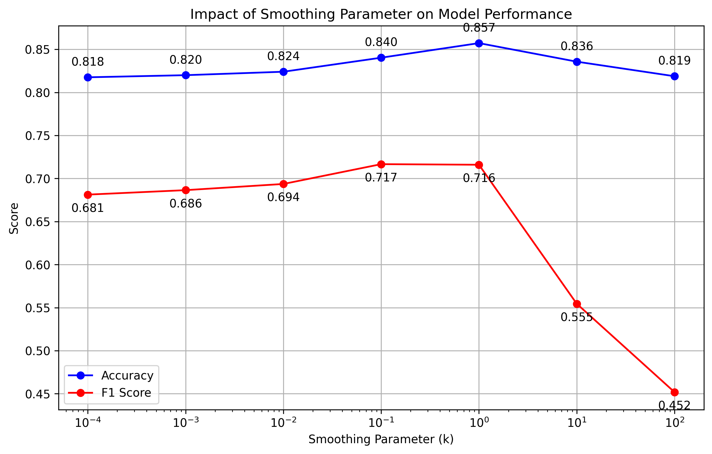

# Assignment 1

## 4.2
### Impact of Smoothing Parameter on Naive Bayes Model

When k=1 (best performance):
- Provides optimal balance between seen and unseen words
- Gives reasonable probability to unseen words without overly discounting seen words
- Accuracy (0.8572) and F1 (0.7160) are highest because the model can handle both common and rare words effectively

When k is small (k < 1):
- Model relies too heavily on observed frequencies
- Gives very low probabilities to unseen words
- Leads to lower accuracy and F1 scores because the model struggles with new or rare words in the test set

When k is large (k > 1):
- Over-smooths the probabilities
- Makes word probabilities too uniform across classes
- Sharp drop in F1 score (down to 0.4519 at k=100) indicates model loses ability to distinguish between offensive and non-offensive text
- Large k essentially erases the meaningful differences between word frequencies in different classes

As a result, k=1 works best because it provides just enough smoothing to handle unseen words while preserving the discriminative power of the observed word frequencies in the training data.

## 4.3
### Comparison of Different Feature Engineering Approaches

#### Baseline (Original Features)
- Accuracy: 0.857
- F1 Score: 0.716

#### Feature Set 1: Stop Words Removal
- Accuracy: 0.861
- F1 Score: 0.719

While stop word removal slightly improved the result, 
the gain was minimal. In hate speech, even function words like pronouns (they, we, you) can carry underlying bias or hostility. Complete removal of stop words might eliminate these contextual clues.

#### Feature Set 2: Bigrams
- Accuracy: 0.858
- F1 Score: 0.709

Similar performance to baseline suggests single words are already 
strong indicators. Hate speech might not heavily rely on word combinations. Increased feature space without capturing significantly more meaningful patterns.

#### Feature Set 3: Stemming
- Accuracy: 0.826
- F1 Score: 0.601

Drop in both accuracy and F1 score. Morphological variations of words 
might carry important emotional or intentional differences for hate speech detection.
